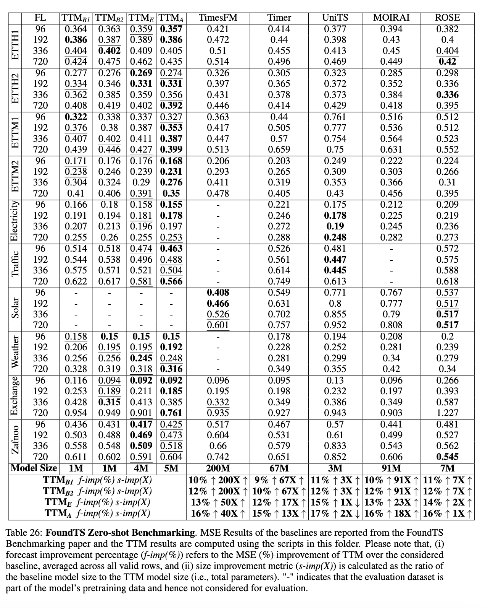
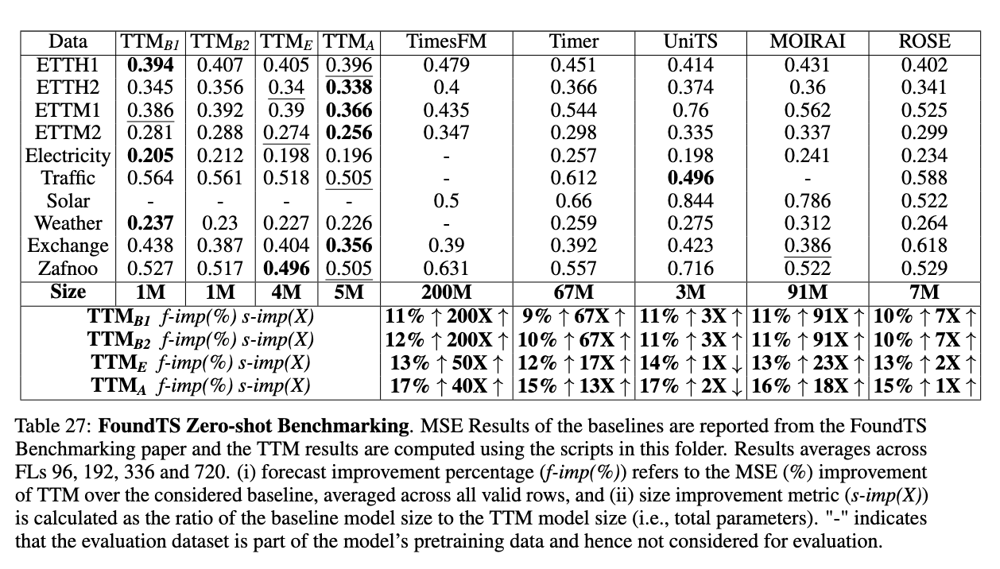

# Note to FoundTS leaderboard team

- [FoundTS-Leaderboard](https://arxiv.org/abs/2410.11802) provides a general benchmarking framework for zero-shot and few-shot forecasting using time-series foundation models.
- We thank the authors of the paper for providing this benchmarking system which is very essential in the current literature space.
- However, we observe that the TTM numbers reported as part of the benchmarking are not computed correctly. Hence, we are sharing the scripts here to correctly run the TTM models on the benchmarked datasets (ETTH1, ETTH2, ETTM1, ETTM2, Weather, Traffic, Electricity, Zafnoo, Exchange). Please note that, Solar dataset is used as part of the TTM pretraining. Hence TTM's results on Solar is extremely good and should not be considered for Zero-shot evaluation. Likewise, Weather and Electricity is part of TimesFM pretraining data and Traffic is part of both TimesFM and Moirai. Hence, we should exclude these results in zero/few-shot comparisons.
- Since TTM requires at least 512 time-points in the context length, we ignore short-context length datasets such as ILI, NASDAQ, NN5, Wike2000 where TTM cannot be applied currently.
- We request the authors to update their benchmarking/leaderboard table accordingly.
- As per the below zeroshot results, TTM outperforms other approaches on most of the datasets by a good margin. 


# Updated zeroshot FoundTS table with correct TTM numbers





# Steps to reproduce

## Fetching the data
The evaluation data can be downloaded from any of the previous time-series github repos like Autoformer, TimesNet, Informer, or FoundTS repo. [Sample download link](https://drive.google.com/drive/folders/1vE0ONyqPlym2JaaAoEe0XNDR8FS_d322). The ETT datasets can also be downloaded from [ETT-Github-Repository](https://github.com/zhouhaoyi/ETDataset). 

Download and save the datasets in a directory. For example, in `data_root_path`. 

CSVs of each data should reside in location `data_root_path/$dataset_name/$dataset_name.csv` for our data utils to process them automatically.


## Running the scripts

1. In a terminal, run `sh ttm-a-1536.sh`
2. Run `summarize_results.py`. For example, 

```bash
sh ttm-a-1536.sh data_root_path/
python summarize_results.py -rd=results-ttm-a/
```

The above commands will run all benchmarking and dump the results. The dumped results are available as CSV files. 

## Different TTM Models:
- TTM-B1: Refers to TTM results with 512 context length and frequency prefix tuning enabled: `ttm-b1-512.sh`
- TTM-B2: Refers to TTM results with 512 context length: `ttm-b1-512.sh`
- TTM-E: Refers to TTM results with 1024 context length: `ttm-e-512.sh`
- TTM-A: Refers to TTM results with 1536 context length: `ttm-a-512.sh`

## Few-shot results

We also request that the FoundTS authors follow the same approach mentioned in the script for few-shot results. We couldn't report the few-shot results as TTM's sampling technique is different from the sampling technique used in the FoundTS method and we are facing challenges to replicate the exact sampling approach followed in FoundTS.

## Disclaimer: 
Please note that the intent of this file is to report and provide updates to the TTM numbers in the FoundTS benchmarking paper and leaderboard. MSE results reported in the above tables of other models are directly taken from the FoundTS benchmarking paper and not computed by us. 