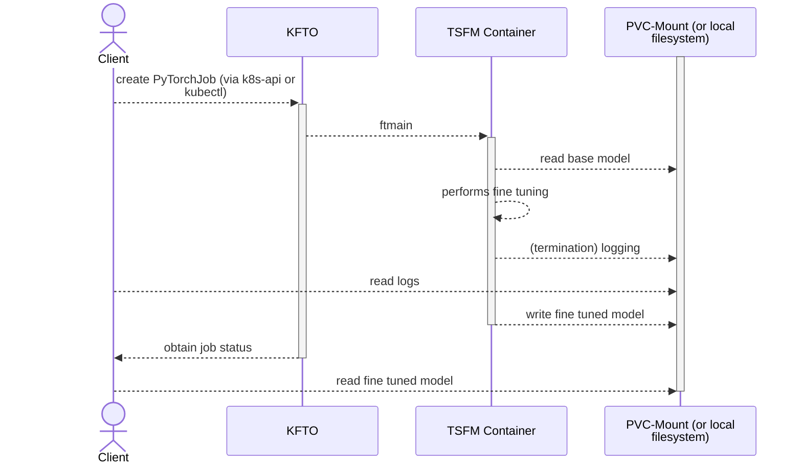

# Finetuning

```mermaid
%%{init: { "sequence": { "wrap": true, "width":200 } } }%%
sequenceDiagram
    actor C as Client
    participant K as KFTO
    participant T as TSFM Container
    participant P as PVC-Mount (or local filesystem)

    activate P
    C-->>+K:create PyTorchJob (via k8s-api or kubectl)
    K-->>+T:ftmain
    T-->>P: read base model
    T-->>T: performs fine tuning
    T-->>P: (termination) logging

    C-->>P: read logs


    T-->>P: write fine tuned model
    deactivate T
    K-->>-C: obtain job status

    C-->>P: read fine tuned model
    deactivate P


```
