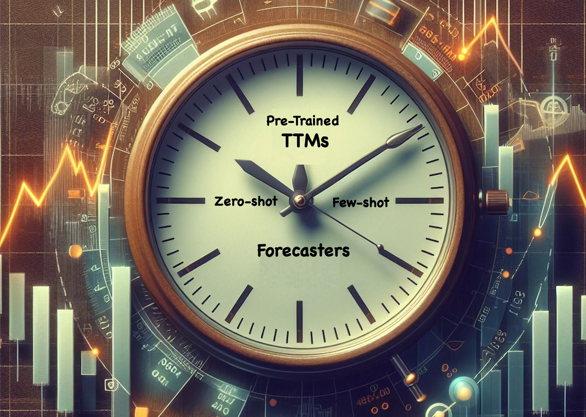

# TinyTimeMixer (TTM)

TinyTimeMixer (TTM) are compact pre-trained models for Time-Series Forecasting, open-sourced by IBM Research. **With less than 1 Million parameters, TTM introduces the notion of the first-ever “tiny” pre-trained models for Time-Series Forecasting.**

TTM outperforms several popular benchmarks demanding billions of parameters in zero-shot and few-shot forecasting. TTM is pre-trained on diverse public time-series datasets which can be easily fine-tuned for your target data. Refer to our [paper](https://arxiv.org/pdf/2401.03955.pdf) for more details. The current open-source version supports forecasting use-cases ranging from minutely to hourly resolutions (Ex. 10 min, 15 min, 1 hour, etc.)

**Note that zeroshot, fine-tuning and inference tasks using TTM can easily be executed in 1 GPU machine or in laptops too!!**

**HuggingFace Model Card:** https://huggingface.co/ibm/TTM

# Benchmark Highlights:
- TTM (with less than 1 Million parameters) outperforms the following popular Pre-trained SOTAs demanding several hundred Million to Billions of parameters:
    - GPT4TS (NeurIPS 23) by 7-12% in few-shot forecasting.
    - LLMTime (NeurIPS 23) by 24% in zero-shot forecasting.
    - SimMTM (NeurIPS 23) by 17% in few-shot forecasting.
    - Time-LLM (ICLR 24) by 8% in few-shot(5%) forecasting
    - UniTime (WWW 24) by 27% in zero-shot forecasting.
- Zero-shot results of TTM surpass the few-shot results of many popular SOTA approaches including PatchTST (ICLR 23), PatchTSMixer (KDD 23), TimesNet (ICLR 23), DLinear (AAAI 23) and FEDFormer (ICML 22).
- TTM (1024-96, released in the HF model card with 1M parameters) outperforms pre-trained MOIRAI-Small (14M parameters) by 10%, MOIRAI-Base (91M parameters) by 2% and MOIRAI-Large (311M parameters) by 3% on zero-shot forecasting (fl = 96) [[notebook]](../../../notebooks/hfdemo/tinytimemixer/ttm_benchmarking_1024_96.ipynb)
- TTM quick fine-tuning also outperforms the hard statistical baselines (Statistical ensemble and S-Naive) in M4-hourly dataset which existing pretrained TS models are finding hard to outperform. [[notebook]](../../../notebooks/hfdemo/tinytimemixer/ttm_m4_hourly.ipynb)
- TTM takes only a few seconds for zeroshot/inference and a few minutes for finetuning in 1 GPU machine, as opposed to long timing-requirements and heavy computing infra needs of other existing pretrained models.

# Model Details
For more details on TTM architecture and benchmarks, refer to our [paper](https://arxiv.org/pdf/2401.03955.pdf).

TTM-1 currently supports 2 modes:

- **Zeroshot forecasting:** Directly apply the pre-trained model on your target data to get an initial forecast (with no training).

- **Finetuned forecasting:** Finetune the pre-trained model with a subset of your target data to further improve the forecast.

**Since, TTM models are extremely small and fast, it is practically very easy to finetune the model with your available target data in few minutes to get more accurate forecasts.**

The current release supports multivariate forecasting via both channel independence and channel-mixing approaches. Decoder Channel-Mixing can be enabled during fine-tuning for capturing strong channel-correlation patterns across time-series variates, a critical capability lacking in existing counterparts.

In addition, TTM also supports exogenous infusion and categorical data which is not released as part of this version. Stay tuned for these extended features.

# Recommended Use
- Users have to externally standard scale their data before feeding it to the model (Refer to TSP, our data processing utility for data scaling followed in the below notebooks)
- Enabling any upsampling or prepending zeros to virtually increase the context length is not recommended and will impact the model performance.

# Installation:
For Installation steps, refer [here](https://github.com/IBM/tsfm/tree/ttm)

# Getting started with TinyTimeMixer (TTM)
- Getting started notebook: [here](../../../notebooks/hfdemo/ttm_getting_started.ipynb)
- Illustration notebook for 512-96 model on the considered target datasets: [here](../../../notebooks/hfdemo/tinytimemixer/ttm_benchmarking_512_96.ipynb)
- Illustration notebook for 1024-96 model on the considered target datasets: [here](../../../notebooks/hfdemo/tinytimemixer/ttm_benchmarking_1024_96.ipynb)
- M4-hourly transfer learning example: [here](../../../notebooks/hfdemo/tinytimemixer/ttm_m4_hourly.ipynb)
- Sample pretraining script: [here](../../../notebooks/hfdemo/tinytimemixer/ttm_pretrain_sample.py) 

## Sample Datasets required for the above notebooks

The evaluation datasets utilized in these scripts are `etth1, etth2, ettm1, ettm2, weather, electricity, traffic, m4-hourly`.
The datasets should be stored in a directory (e.g., `datasets/`) in the follwing structure for the function `get_data` to work. See the the implementation of `get_data()` [here](../../../notebooks/hfdemo/tinytimemixer/utils/ttm_utils.py).
Specify this path (e.g., `datasets/`) in the example notebooks.

**Structure of the `datasets/` folder**
- ETT datasets: "datasets/ETT-small/ETT*.csv"
- Weather dataset: "datasets/weather/weather.csv"
- Electricity dataset: "datasets/electricity/electricity.csv"
- Traffic dataset: "datasets/traffic/traffic.csv"
- M4-hourly dataset: "datasets/m4/*.csv"

The datasets can be downloaded from the Informer model's repository https://github.com/zhouhaoyi/Informer2020.
